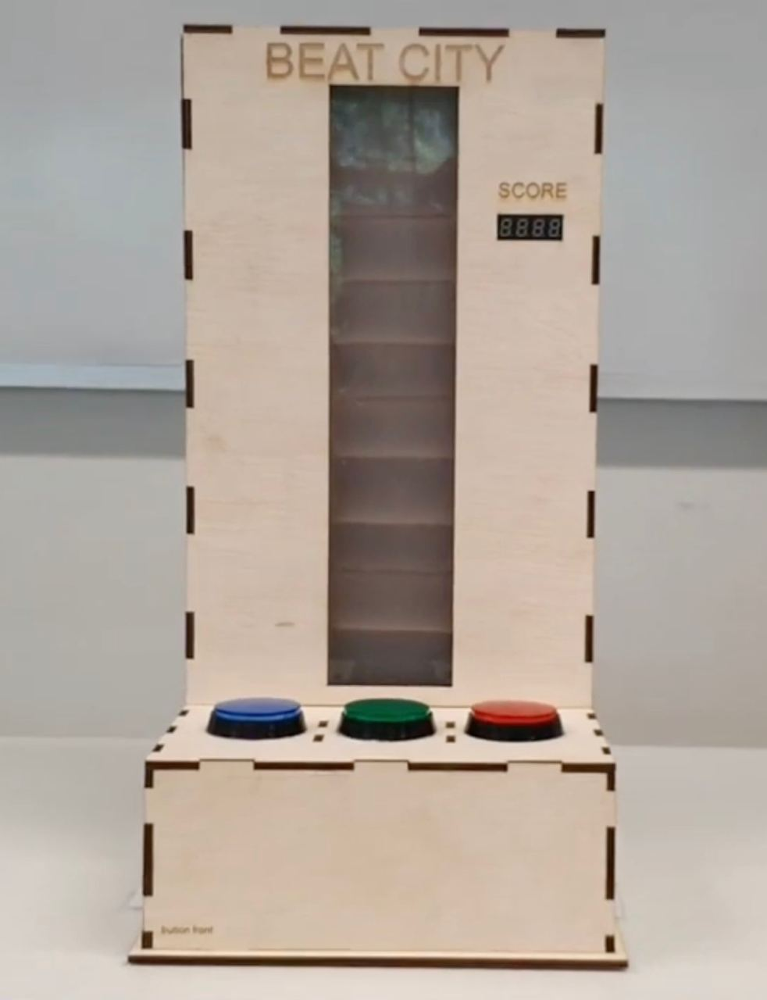
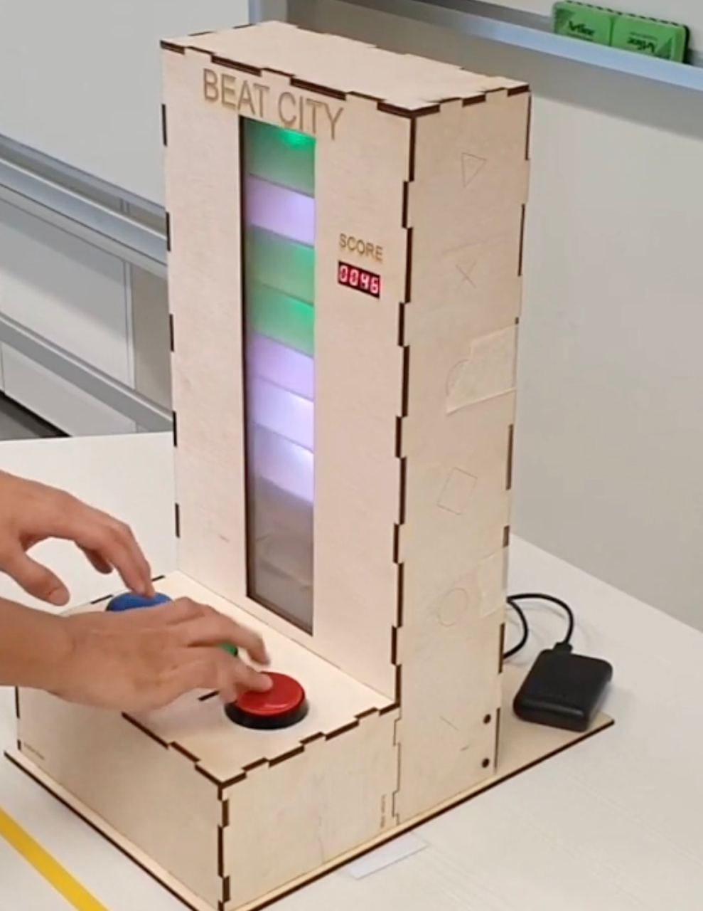

# Beat City

An arcade-style game powered by an FPGA created for the 50.002 course in Fall 2020.

## Description

Race against the coloured blocks as they cascade down the display. Press the button with the corresponding colour to clear the block at the bottom of the column. Press any button to clear the wildcard white block. Each block cleared increases your score.

Sounds easy? Fret not. The blocks will appear faster and faster the longer you survive, until you have no choice but to admit defeat.

## Technical Details

Here are some brief details about how the game was created:

- The logic for the game was programmed using Lucid on an FPGA.
- RGB LEDs, separated by opaque dividers, were used to display the coloured blocks.
- A 7-segmnet display was used to display the score.

For more information, please visit the following links:

- [Video walkthrough of the game and how it was built](https://www.youtube.com/watch?v=rLnOIjl43-I)
- [Game poster](https://drive.google.com/file/d/1NlZB8nUd5N_D_zZHcdn_7VXc5ze-EEo3/view?usp=sharing)
